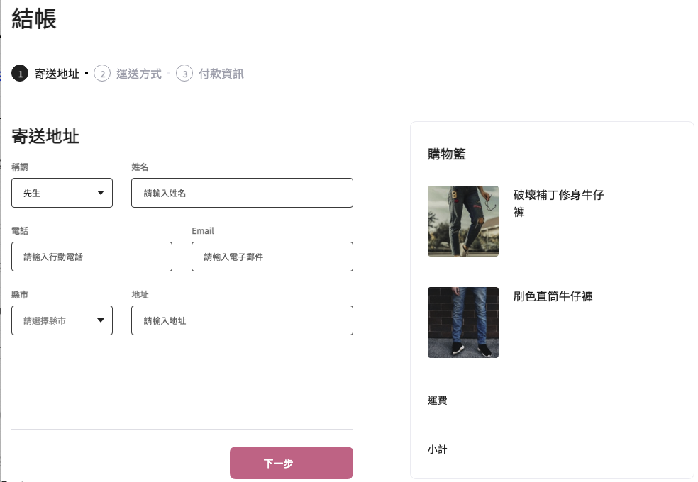

# 🛍️ Project [ALPHA shop] with React.js

> **Noted: This is a project in-progress.**

> This project was bootstrapped with [Create React App](https://github.com/facebook/create-react-app).


_Phase 1 submitted screenshot (2023 Feb 12 Sun.)_

### Feature:

Phase 1: practice dividing React Components. Show the main static layout.

## 🧑🏻‍💻 Installation

Run terminal first and check if installed Node.js by 
```
$ node -v
```

Clone the project to local
```
$ git clone https://github.com/LJBL22/alpha-shop.git
```

Go to the directory
```
$ cd alpha-shop
```

Install npm
```
$ npm install
```

Install Sass
```
$ npm i sass
```

Start the project
```
$ npm start
```

You can now view alpha-shop in the browser at
```
$ localhost:3000
```

You can leave the project by
```
$ ctrl + C
```

## 🛠️ Develop Tools and Packages Used
- Node.js @14.16.0
- Sass: ^1.58.0
- All packages and webpack settings provided by using create-react-app
