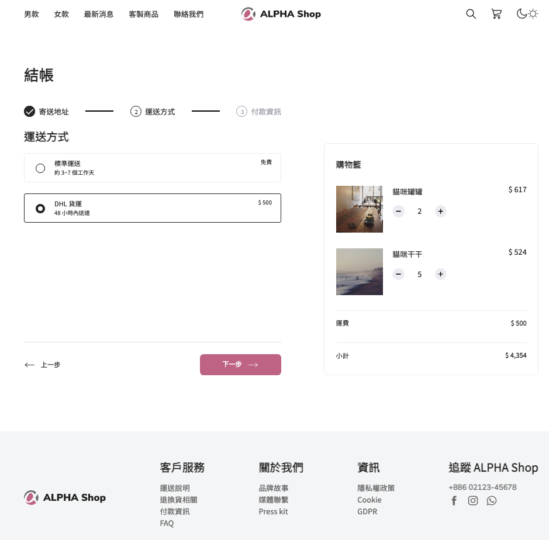

# 🛍️ Project [ALPHA shop] with React.js

> **Noted: This is a project in-progress.**

> This project was bootstrapped with [Create React App](https://github.com/facebook/create-react-app).


_Phase 3 submitted screenshot (2023 Mar 3 Fri.)_

~~_Phase 2 (2023 Feb 16 Thur.)_~~

~~_Phase 1 (2023 Feb 12 Sun.)_~~

## 👀 Add Feature:

Phase 1: practice dividing React Components. Show the main static layout.

Phase 2: use rendering list skill, import svg as React Component, using constants file to collect data, finish the main layout

Phase 3: start to use hook: useState:
Left column: register progress, three phases, and radio group state changing.
Right column: cart minus & plus quantity, total amounts including shipping fee.

## 🧑🏻‍💻 Installation

Run terminal first and check if installed Node.js by

```
$ node -v
```

Clone the project to local

```
$ git clone https://github.com/LJBL22/alpha-shop.git
```

Go to the directory

```
$ cd alpha-shop
```

Install npm

```
$ npm install
```

Install Sass

```
$ npm i sass
```

Start the project

```
$ npm start
```

You can now view alpha-shop in the browser at

```
$ localhost:3000
```

You can leave the project by

```
$ ctrl + C
```

## 🛠️ Develop Tools and Packages Used

- Node.js @14.16.0
- Sass: ^1.58.0
- All packages and webpack settings provided by using create-react-app
